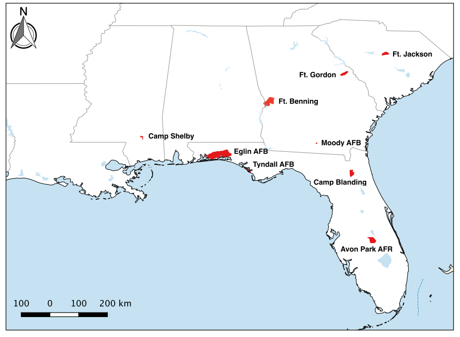
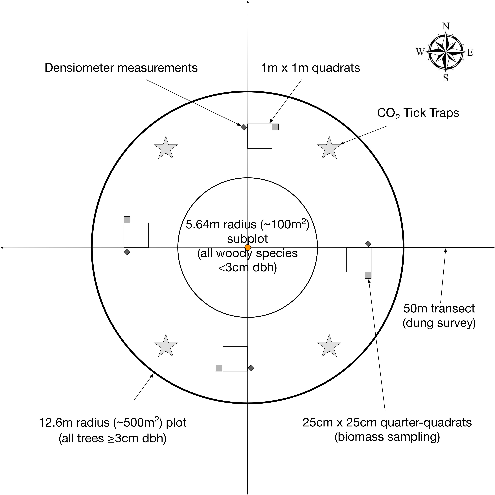
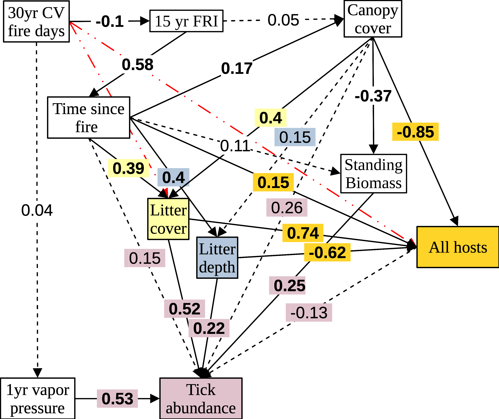

```{r setup, include=FALSE, cache=FALSE, message = FALSE}
library(knitr)

#opts_knit$set(root.dir=normalizePath('../'))

### Chunk options: see http://yihui.name/knitr/options/ ###

## Text results
opts_chunk$set(echo = FALSE, warning = FALSE, message = FALSE, include = TRUE)

## Code decoration
opts_chunk$set(tidy = TRUE, comment = NA, highlight = TRUE)

## Cache
opts_chunk$set(cache = 2, cache.path = "output/cache/")

## Plots
opts_chunk$set(fig.path = "output/figures/")
opts_chunk$set(fig.height = 6.5, fig.width = 6.5)

## Additional packages
library(tidyverse)

```


```{r knitcitations, echo=FALSE, cache=FALSE}
library(knitcitations)
library(RefManageR)
# [RefManageR](https://cran.r-project.org/web/packages/RefManageR/index.html) to fetch bibliographic metadata automatically from the web. For example, citing a paper can be as easy as providing its DOI `r citep("10.1016/j.tree.2006.03.016")` or even just a few keywords `r citep("Ricklefs 2008 American Naturalist")`.

## citep() for inline paranthetical citations
## citet() for inline text citations
cleanbib()   
cite_options(citation_format = "pandoc")

# [@Yan2011; @Sutherland2011], if you provide a `BibTeX` file with references

```


\singlespace

\vspace{2mm}\hrule

# Abstract

\vspace{3mm}\hrule

*Keywords*: Amblyomma americanum, climate change, disease ecology, fire management, Lone-star tick, longleaf pine, vector-borne disease

\doublespace

\bleft


# Introduction
```{r child='introduction.Rmd'}

```


# Methods
## Path Analysis
We used structural equations modeling (SEM) to evaluate the hypothesized direct and indirect effects of climate, fire management, vegetation, and host abundance on tick-borne disease exposure risk. Structural equations modeling is powerful in conceptualizing and then testing the direct and indirect effects of multiple process influencing ecological systems (Grace et al. 2010). Specifically, we applied path analysis (Wright 1921, Shipley 2004) to evaluate a specific set of factors hypothesized to affect tick abundance and thereby tick-borne disease risk. Based on published knowledge of dynamics among climate change, fire, vegetation, wildlife, and tick abundances we developed the path model structure in Figure \@ref(fig:psem-structure). Each box in this figure that has at least one arrow pointing to it is a response variable in a model and each box where an arrow is rooted is a predictor variable. Variable descriptions are in Table \@ref(tab:psem-variables-table). 

We evaluated this path model using the R package piecewiseSEM v2.2.1 (Lefcheck 2016), which allows models with different distributional forms to be evaluated together in the same SEM. Host and tick abundance responses were modeled using the Poisson distribution, while a Gaussian distribution was used for all other response variables. The percent litter cover was logit transformed and the time since fire was natural log-transformed to improve normality and homoscedasticity of residuals. The global fit of the path model was checked using Fisher’s C, which is based on topology of the SEM (Shipley 2000, 2013), and Chi-squared statistic based on maximum likelihood estimation (Shipley and Douma 2020) as implemented in the piecewiseSEM package, where P-values >0.05 indicate that the proposed structural model is consistent with the data. The maximum likelihood estimation comparison is made between model structures without paths between one or more variables and the fully saturated model where there are no missing paths. Finally, relative direct and indirect effects are interpreted using standardized coefficients reported on each path. Direct effects are arrows pointing directly to a response variable, while indirect effects are those that are at least once removed from another response variable. The indirect effect of a variable is calculated by multiplying the significant (we used P<0.05) coefficients along the path(s) to the response of interest. The total effect is the sum of the direct and indirect effects.

```{r psem-structure, out.width="50%", fig.cap="Path model structure."}
knitr::include_graphics("figures/path_analysis_DAG1.png")
```

Estimates of tick abundance were calculated for each plot visit as the number of ticks collected per trap. Tick abundance is directly related to TBD exposure risk because more ticks typically results in a higher prevalence of infected ticks and greater probability of being bitten. Host abundance was estimated simply as the count of dung clusters because for each plot visit sampling was equal, i.e. always 400 m^2^ surveyed. With hosts being necessary for ticks to complete their life cycle, greater host abundance is expected to have the direct effect of greater tick abundance.

Litter cover, litter depth, and standing understory biomass are each expected to have a direct effect on tick abundance. Deeper litter and greater cover provide critical refuge for ticks when local microclimate conditions are unfavorable (i.e. dry and/or hot), thus having a positive effect on tick abundance. Similarly, standing understory biomass can further mediate microclimate to create more favorable local conditions when the weather is widely unfavorable (*citation*). We tested the direct effect of each litter variable on host abundance where we expected greater litter cover and depth to result in lower host abundance estimates because detection is more difficult in these conditions.

Overstory canopy cover affects host abundance, standing biomass, both litter variables, and tick abundance directly. Effects on tick abundance are presumed through processes regulating microclimate across the plot area similar to standing biomass. The effect on host abundance is expected due to the structural and broader area microclimate conditions created and regulated by canopy cover. Greater canopy cover is expected to result in less standing biomass because of shading. Finally, greater canopy cover is expected to generate greater litter cover and depth because more leaves fall to the ground.

Recent weather conditions (during the previous year) are expected to directly affect tick abundances because overall poor or favorable conditions can affect success of each tick life stage. The resolution of the Daymet data covered more than one plot, so this is interpreted as the broad weather conditions over the area rather than local conditions in the plot.

We used two fire-related measures in the path model, 1. time since last fire and 2. the 15-year fire return interval. Time since last fire was intended to capture direct effects of fire (or lack thereof) on ticks, hosts, and vegetation, with expected increases in each of these with more time passing since the plot was last burned. The 15-year fire return interval represents the fire regime for the plot. Finally, to evaluate how climate may affect fire management we calculated coefficient of variation for the number of “fire days”, defined as days with <6 mm of recorded precipitation.

```{r psem-variables-table}
model_variables <- data.frame(
  Variable = c(
    "Tick abundance",
    "Host abundance",
    "Litter cover",
    "Litter depth",
    "Standing biomass",
    "Canopy cover",
    "Recent weather",
    "Time since fire",
    "Fire regime – 15 yr FRI",
    "Climate – 30yr CV fire days"
  ),
  Description = c(
    "Number of ticks per trap at each plot – tick abundance scaled by trapping effort",
    "Total host dung clusters observed on transects (400 m2 surveyed)",
    "Percent litter cover in each plot averaged from four samples (logit transformed)",
    "Average litter depth (cm) in each plot from four samples",
    "Average standing understory biomass (g) in each plot from four samples (natural log transformed)",
    "Percent overstory canopy cover in each plot averaged from four measurements",
    "1yr vapor pressure	Averaged daily vapor pressure values at each plot calculated from Daymet data for the 365 days leading up to sampling date",
    "Number of days since the plot was last burned",
    "15-year fire return interval for each plot (average number of years between fires). Calculated in GIS using data provided by installations",
    "30-year average of annual coefficient of variation of fire days defined as having <6 mm of recorded precipitation. Calculated from Daymet data"
  )
)

knitr::kable(model_variables, caption = "Path model variables and descriptions.")
```

We used `R` `r knitcitations::citep(citation())` for all analyses. 
Multilevel models were fit using the `lme4` package `r knitcitations::citep(citation("lme4"))`, model diagnostics were performed using the `DHARMa` package `r knitcitations::citep(citation("DHARMa"))`. The `piecewiseSEM` package was used for the path analysis `r knitcitations::citep(citation("piecewiseSEM"))`.

These were implemented in dynamic rmarkdown documents using `knitr` `r knitcitations::citep(citation("knitr"))` and `rmarkdown` `r knitcitations::citep(citation("rmarkdown"))` packages.


## Study Area

The study region is defined as five states in the southeastern U.S.A. (i.e., Mississippi, Alabama, Georgia, South Carolina, and Florida \@ref(fig:studyarea). The region has the highest frequency of wildfire and prescribed fire management of any forests in the 20 states comprising the Eastern Region of the USFS `r citep("Stephens 2005 Federal forest-fire policy")` and includes most of the geographic distribution of the primary target tick species, *A. americanum* [@ChildsAscendancyAmblyommaamericanum2003].

Within the study region, we collected data at nine military installations (i.e., Avon Park AFR, Fort Benning, Camp Blanding, Eglin AFB, Fort Gordon, Fort Jackson, Moody AFB, Camp Shelby, and Tyndall AFB). Each installation is divided into burn units, with different fire management histories. At least one sample plot was established within each burn unit selected. These plots were considered the smallest experimental unit of replication for all data analyses. The plots across all installations sampled are summarized in Table \@ref(tab:plots-sampled-table).

```{r studyarea, out.width="50%", fig.cap="Map of installations visited across the southeast USA."}

```


## *A. americanum*
*A. americanum*-associated diseases, both for the general public and DoD personnel [@DemmaEpidemiologyHumanEherlichiosis2005; @KellyPresentThreatRickettsial2002; @StromdahlPrevalenceInfectionTicks2001]

## Data collection

### *Plot design*
Each plot consisted of a main circular center plot (12.6 m radius, approximately 500 m2), a circular subplot (5.64 m radius, approximately 100 m2), four 1 m x 1 m quadrats, four 25 cm x 25 cm quadrats, four 50 m transects, and four locations for sampling tick abundance (Figure \@ref(fig:plotdesign)). In the main circular plot and subplot, we measured trees, saplings, and shrubs. Ground vegetation and litter were measured in 1 m and 25 cm quadrats located 10 m from plot center in each of the cardinal directions. The 50 m transects originated at the plot center going in each cardinal direction and were used to estimate tick-host abundance. Tick abundance sampling locations were placed 8-10 m from the plot center in the NW, NE, SE, and SW areas. The center of each plot was marked with a flag and GPS coordinates were recorded using a Garmin Oregon 650t GPS unit (Olathe, KS).

```{r plotdesign, out.width="50%", fig.cap="Diagram of field sampling plot layout."}

```


### *Fire history*
We obtained fire history and known cogongrass invasions as spatial layers from each installation. Using these data we calculated the time since last fire and the 15-year fire return interval for each plot based on the date of our data collection. Time since last fire was calculated in days from the sampling date to the most recent date a fire was recorded in the data from installations. 

### *Tick trapping*
We collected ticks using CO~2~ traps placed in each plot for 24 hours. Tick traps were constructed by mounting 5-quart hard-sided coolers (Igloo, Katy, TX) onto the center of 0.635 cm (1/4 inch) thick plywood pieces cut to 35 cm x 28 cm. There was approximately 7.6 cm between the edge of the plywood and all sides of the cooler. Two 0.48 cm (3/16 inch) holes were drilled through each side of the cooler just above the bottom of the interior. Strips of double-sided carpet tape (DF 545, ShurTape, Hickory, NC) measuring 4.77 cm (1.88 in) wide were attached to the plywood surface surrounding the cooler. Each trap was baited with 1.5 kg of dry ice, which sublimated out through the holes drilled in the coolers. A rain cover made from corrugated plastic roofing cut to cover the entire footprint of the trap was attached to the top of each cooler by drilling a 0.48 cm hole through the center of the cooler lid and securing the roofing using a bolt and a wing-nut.

To collect ticks attracted by the traps but not stuck to the tape, we dragged a 1 m x 1 m white canvas cloth across the area directly below each trap three times. Ticks were also collected off of personnel and were assigned a plot, burn unit, or installation depending on the confidence in where the encounter occurred. Ticks collected on traps were counted and removed from the tape using tweezers, placed in 2 mL vials (Corning 430659) with 70% ethanol, and transported to the Flory Lab at the University of Florida where they were identified, sorted, and counted by species, life stage, and sex. Sorted ticks were then shipped to the Allan Lab at the University of Illinois where they underwent a second round of identification and sorting, and were then subjected to pathogen analysis.

### *Host surveys*
We conducted host-dung surveys along each 50 m transect to estimate abundance of tick hosts near the plot area. Observed dung clusters of host species (e.g. white-tailed deer, *Odocoileus virginianus*) were tallied within 1 m on either side of the transect line, totaling 400 m^2^ of surveyed area within and nearby the plot. Species were identified by dung characteristics.

### *Ground cover and litter data collection*
We identified plant species and measured vegetation and litter conditions in each of the four 1 m quadrats. We recorded the percent cover of each plant species, total plant cover, litter cover, and bare ground, and counted the number of stems of each species rooted within the quadrat. Percent cover was visually estimated and estimates were calibrated among observers to ensure consistency. We measured the three tallest heights of woody species and the three tallest heights of non-woody species rooted within each quadrat. Heights were measured from the mineral soil surface. We also made three measurements of litter depth in each quadrat from the top of the litter level to the mineral soil surface. The 25 cm quadrats were placed adjacent to each 1 m quadrat in an area representative of the conditions in the larger quadrat, and we collected vegetation and litter in order to estimate biomass. We collected all above-ground fine vegetation and litter within the 25 cm quadrat into separate bags. Samples were weighed at the end of the day to estimate fresh weights, then were returned to the Bivens Arm Research Site at the University of Florida, placed in a 60ºC drying oven for at least 72 hours, and then weighed to obtain dry weights. The dry weight values were used in modeling.

### *Tree and shrub data collection*
Within the 12.6 m radius plot we recorded the DBH of all trees ≥ 3 cm DBH to the nearest 0.1 cm. Each tree was assigned a health category and relative canopy position. We recorded the heights of at least 10 trees in the plot (or all trees if fewer than 10) that were representative of each identified canopy position. In the 5.64 m radius subplot we recorded the abundance of woody species (shrubs and tree seedlings/saplings) that were < 3 cm DBH and ≥ 100 cm tall. We also estimated overstory canopy cover for the plot by taking measurements using a spherical convex densiometer (Forestry Suppliers, Jackson, MS) while standing at each 1 m quadrat and facing plot center.


### *Climate data*
The DoD installations selected spanned a climate gradient across the southeastern U.S. to provide a range of climate conditions for modeling relationships between climate factors and tick-borne disease risk under current and future climate. To characterize this climate gradient, we retrieved daily climate data (1980-present) for each installation from the Daymet dataset (Thornton et al. 2016; https://daymet.ornl.gov/), which provides daily values for maximum and minimum temperature, precipitation, solar radiation, vapor pressure, and day length, at a 1 km x 1 km resolution. Values were extracted using the R package ‘daymetr’ (Hufkens et al. 2018) and then summarized in various ways (e.g., annual averages, days above or below threshold values) to explore and evaluate the potential influence of climate and weather on tick abundance, host abundance, vegetation, and prescribed fire management across the study region.


# Results

## Path analysis

```{r load packages and data}
library(tidyverse)
library(sjPlot)
library(patchwork)
library(MuMIn)
library(DHARMa)
library(lme4)
library(piecewiseSEM)

sem_data <- read_csv("data/path_analysis_data.csv")
# sem_data %>% 
#   select(deer:total_clusters1m) %>% 
#   colSums( ) %>% 
#   knitr::kable()

sem_data <- sem_data %>%
  mutate(biomass_log = log(avg_dry_standing_gm2),
         d_since_fire_log = log(d_since_fire),
         logit_litter = car::logit(avg_pct_litter)
  )
## Make a rounded-up ticks per trap variable for Poisson and NegBin
## distribution compatibility, i.e. 0< x <1 == 1, and all other rounded to next
## larger integer
sem_data$tpt <- ceiling(sem_data$ticks_per_trap)
```


```{r ticks per trap sub model}
tpt_pois <- glmer(
  tpt ~ d_since_fire_log + logit_litter + avg_litter_depth_all + avg_canopy_cover + biomass_log + total_clusters1m + avg_1yr_vp..Pa. + (1|inst_name/plot_id),
  data = sem_data, na.action = "na.fail",
  family = poisson(link = "log"),
  control=glmerControl(optimizer = "Nelder_Mead", optCtrl=list(maxfun=1e6))
  )
```

```{r host abundance sub model}
host_mod_all <- glmer(
  total_clusters1m ~ d_since_fire_log + avg_canopy_cover + logit_litter + avg_litter_depth_all + (1 | inst_name/plot_id), 
  data = sem_data, family = poisson(link = "log"),
  control = glmerControl(optimizer="Nelder_Mead", optCtrl=list(maxfun=1e6))
  )
```

```{r litter cover submodel}
litter_cover_mod <- lmer(logit_litter ~ d_since_fire_log + avg_canopy_cover + (1|inst_name/plot_id), data = sem_data)
```

```{r litter depth sub model}
litter_depth_mod <- lmer(avg_litter_depth_all ~ d_since_fire_log + avg_canopy_cover + (1|inst_name/plot_id), data = sem_data)
```

```{r standing biomass submodel}
standing_biomass_mod <- lmer(biomass_log ~ d_since_fire_log + avg_canopy_cover + (1|inst_name/plot_id), data = sem_data)
```

```{r overstory canopy cover submodel}
canopy_mod <- lmer(avg_canopy_cover ~ d_since_fire_log + fri15yr + (1|inst_name/plot_id), data = sem_data)
```

```{r time since fire submodel}
time_since_fire_mod <- lmer(d_since_fire_log ~ fri15yr + (1|inst_name/plot_id), data = sem_data)
```

```{r fire return interval submodel}
fri_mod <- lmer(fri15yr ~ cv_30yr_fire_days + (1 | inst_name/plot_id), data = sem_data)
```

```{r annual humidity submodel}
avg_1yr_vp_mod <- lmer(avg_1yr_vp..Pa. ~ cv_30yr_fire_days + (1|inst_name), data = sem_data)
```


```{r path model}
sem_df <- as.data.frame(sem_data)

## All hosts
all_hosts_psem <- psem(
  tpt_pois,
  host_mod_all,
  litter_cover_mod, 
  litter_depth_mod, 
  canopy_mod,
  standing_biomass_mod,
  time_since_fire_mod, 
  fri_mod,
  avg_1yr_vp_mod,
  
  data = sem_df
)

ah_psem_summary <- summary(all_hosts_psem, .progressBar = FALSE)
ah_ChiSq <- ah_psem_summary$ChiSq
ah_Cstat <- ah_psem_summary$Cstat
ah_AIC <- ah_psem_summary$AIC

all_hosts_psem_corrs <- psem(
  tpt_pois,
  host_mod_all,
  litter_cover_mod, 
  litter_depth_mod, 
  canopy_mod,
  standing_biomass_mod,
  time_since_fire_mod, 
  fri_mod,
  avg_1yr_vp_mod,
  
  logit_litter %~~% cv_30yr_fire_days, 
  total_clusters1m %~~% cv_30yr_fire_days,
  
  data = sem_df
)
ah_psem_corrs_summary <- summary(all_hosts_psem_corrs, .progressBar = FALSE)

## No hosts
tpt_pois_no_hosts_mod <- update(tpt_pois, ~ . -total_clusters1m)
no_hosts_psem <- psem(
  tpt_pois_no_hosts_mod,
  # host_mod_all,
  litter_cover_mod, 
  litter_depth_mod, 
  canopy_mod,
  standing_biomass_mod,
  time_since_fire_mod, 
  fri_mod,
  avg_1yr_vp_mod,
  
  data = sem_df
)
no_hosts_psem_summary <- summary(no_hosts_psem, .progressBar = FALSE)
nh_ChiSq <- no_hosts_psem_summary$ChiSq
nh_Cstat <- no_hosts_psem_summary$Cstat
nh_AIC <- no_hosts_psem_summary$AIC
```

The proposed path model structure was consistent with the data based on the maximum likelihood estimates (χ2 = 17.7, P = 0.91) though significant missing paths were identified (Fisher’s C = 128, P = 0). There were two “missing” paths identified: one going from the 30-year average of the coefficient of variation for fire days to litter cover and one from the 30-year average of the coefficient of variation for fire days to host abundance (Figure \@ref(fig:fittedDAG)). We did not identify any relevant biological mechanisms to explain these relationships, so deemed them spurious correlations perhaps in part due to the coarse resolution of the Daymet data relative to the plot sampling. Accounting for these correlations lowers Fisher’s C to 30 (P = 0.92), indicating a topology consistent with the data. Given that the maximum likelihood value indicated the original graph topology was consistent with the data, we proceeded to interpret this path model. The full set of estimated standardized and unstandardized coefficients are presented in Table \@ref(tab:path-coefs-table).

```{r fittedDAG, out.width="50%", fig.cap="Standardized estimates from fitted path model using abundance of all hosts. Standardized path coefficients indicate relative strength of direct effects. In the dense portion of the graph, highlight color of coefficients corresponds to the response variable. AIC = 4833; Chi-squared = 17.7 (df = 27, P = 0.91); Fisher’s C = 128 (df = 46, p = 0). Passes maximum likelihood test (Chi-squared) but not d-sep (Fisher’s) for acceptable fit because of very small P-values of “missing” paths. Bold coefficient values = P<0.05. Values on dashed paths = P>0.1. Normal text on solid paths = 0.05<P<0.1. Red dash-dot-dot lines are “missing” paths identified during model fitting."}


```


```{r path-coefs-table}
path_model_coefs <- ah_psem_summary$coefficients
path_model_coefs[path_model_coefs == "tpt"] <- "Ticks per trap"
path_model_coefs[path_model_coefs == "total_clusters1m"] <- "Host abundance"
path_model_coefs[path_model_coefs == "logit_litter"] <- "Litter cover"
path_model_coefs[path_model_coefs == "avg_litter_depth_all"] <- "Litter depth"
path_model_coefs[path_model_coefs == "avg_canopy_cover"] <- "Canopy cover"
path_model_coefs[path_model_coefs == "biomass_log"] <- "Standing biomass"
path_model_coefs[path_model_coefs == "d_since_fire_log"] <- "Days since fire"
path_model_coefs[path_model_coefs == "fri15yr"] <- "FRI"
path_model_coefs[path_model_coefs == "avg_1yr_vp..Pa."] <- "Vapor pressure"
path_model_coefs[path_model_coefs == "cv_30yr_fire_days"] <- "CV fire days"

path_model_coefs %>% 
  select(-9) %>%
  mutate(., across(.cols = c(Estimate:Crit.Value, Std.Estimate), .fns = round, digits = 2)) %>%
  bind_cols(., path_model_coefs[,9]) %>%
  rename(" " = ...9, SE = Std.Error, P = P.Value, ) %>% 
  knitr::kable(caption = "Coefficient estimates for each sub model in the fitted path model. Estimate = unstandardized coefficient estimate, SE = standard error of estimate, DF = degrees of freedom in sub model, P = estimated p-value of estimate, Std.Estimate = standardized coefficient estimate.")
```

```{r path-model-r2-table}
R2_values <- ah_psem_summary$R2
R2_values[R2_values == "tpt"] <- "Ticks per trap"
R2_values[R2_values == "total_clusters1m"] <- "Host abundance"
R2_values[R2_values == "logit_litter"] <- "Litter cover"
R2_values[R2_values == "avg_litter_depth_all"] <- "Litter depth"
R2_values[R2_values == "avg_canopy_cover"] <- "Canopy cover"
R2_values[R2_values == "biomass_log"] <- "Standing biomass"
R2_values[R2_values == "d_since_fire_log"] <- "Days since fire"
R2_values[R2_values == "fri15yr"] <- "FRI"
R2_values[R2_values == "avg_1yr_vp..Pa."] <- "Vapor pressure"

names(R2_values) <- str_to_title(names(R2_values))
knitr::kable(R2_values, caption = "Estimated marginal (fixed-effects only) and conditional (fixed and random effects) R2 for each sub-model in the path analysis.")
```


## Plots of significant marginal effects in submodels

### Tick abundance submodel
The model of tick abundance (ticks per trap) captured 65% of the variation, with the fixed-effects portion accounting for 34% (Table \@ref(tab:path-model-r2-table)). Two especially interesting results came from this model: 1. host abundance was not a strong factor in explaining tick abundance and 2. time since fire had only an indirect effect on tick abundance. The lack of an effect of host abundance suggests that abiotic factors are stronger determinants of tick abundance in this ecosystem. The major abiotic driver, fire, has only an indirect effect, primarily through effects on litter cover and litter depth (Figure \@ref(fig:fittedDAG)). The indirect effect of time since fire was relatively stronger than the direct effects of litter depth and standing biomass, and overall had the third strongest effect following the direct effects of litter cover and vapor pressure (Table \@ref(tab:tick-model-effects-table)). The predicted marginal effects of predictors with P<0.05 on ticks per trap were all positive, i.e., predicted tick abundance was greater with increasing litter cover, litter depth, standing understory biomass, and vapor pressure (Figure \@ref(fig:tick-model-marginal-effects)). These relationships illustrate the dominant abiotic effects on tick abundance and support litter and understory vegetation mediating the influence of weather in these ecosystems.

```{r tick-model-marginal-effects, fig.cap="Marginal effects plots for the significant predictors in the tick abundance sub-model in the path analysis. Predicted linear model fit ±95% CI. Points are the data points used in the models. Predicted relationships are with all other variables held at their mean values."}
tpt_mod_pred <- plot_model(tpt_pois, type = "pred", show.data = F)

tpt_lcov <- tpt_mod_pred$logit_litter +
  geom_point(data = sem_df, aes(logit_litter, tpt)) +
  xlab("Litter cover (logit)") + ylab("Predicted tick count") + ggtitle(" ") +
  theme_classic()
tpt_ldep <- tpt_mod_pred$avg_litter_depth_all +
  geom_point(data = sem_df, aes(avg_litter_depth_all, tpt)) +
  xlab("Litter depth (cm)") + ylab("Predicted tick count") + ggtitle(" ") +
  theme_classic()
tpt_biom <- tpt_mod_pred$biomass_log +
  geom_point(data = sem_df, aes(biomass_log, tpt)) +
  xlab("Standing biomass (log)") + ylab("Predicted tick count") + ggtitle(" ") +
  theme_classic()
tpt_vprs <- tpt_mod_pred$avg_1yr_vp..Pa. +
  geom_point(data = sem_df, aes(avg_1yr_vp..Pa., tpt)) +
  xlab("Vapor pressure (Pa)") + ylab("Predicted tick count") + ggtitle(" ") +
  theme_classic()
tpt_lcov + tpt_ldep + ylab("") + tpt_biom + tpt_vprs + ylab("") &
  plot_annotation(tag_levels = 'A') #& theme(axis.title.y = element_text(hjust = 6.5, vjust = -1.5))
ggsave("figures/ticks_per_trap_allhosts_significant_marginal_effects.png", width = 5, height = 5, dpi = 600)
```

```{r tick-model-effects-table}
## Calculate indirect effects
time_since_fire_i <- (.39*.52) + (.4*.22) + (.17*.4*.52) + (.17*-.37*.25)
canopy_cover_i <- (.4*.52) + (-.37*.25)
FRI_i <- (.58*.17*.4*.52) + (.58*.17*-.37*.25) + (.58*.39*.52) + (.58*.4*.22)
cv_fire_days_i <- (.1*.58*.17*.4*.52) + .1*(.58*.17*-.37*.25) + .1*(.58*.39*.52) + .1*(.58*.4*.22)

tpt_effects_allHosts <- tibble(
  Variable = c("CV fire days", "FRI", "time since fire", "canopy cover", 
               "litter cover", "litter depth", "standing biomass", 
               "vapor pressure"),
  Direct = c(0, 0, 0, 0, .52, .22, .25, .53),
  Indirect = c(cv_fire_days_i, FRI_i, time_since_fire_i, canopy_cover_i, 0, 0, 0, 0),
  Total = Direct + Indirect
)
tpt_effects_allHosts %>% 
  knitr::kable(digits = 2, caption = "Direct, indirect, and total effects on tick abundance from the path model when P<0.05 for the estimated path coefficient.")
```

```{r tick-nohosts-effects-table, eval = F}

## No hosts model
noHosts_psem_summary$coefficients
time_since_fire_i <- (.39*.51) + (.4*.24) + (.17*.4*.51) + (.17*-.37*.27)
canopy_cover_i <- (.4*.51) + (-.37*.27)
FRI_i <- (.58*.17*.4*.51) + (.58*.17*-.37*.27) + (.58*.39*.51) + (.58*.4*.24)
cv_fire_days_i <- (.1*.58*.17*.4*.51) + .1*(.58*.17*-.37*.27) + .1*(.58*.39*.51) + .1*(.58*.4*.24)

tpt_effects_noHosts <- tibble(
  variable = c("CV fire days", "FRI", "time since fire", "canopy cover", 
               "litter cover", "litter depth", "standing biomass", 
               "vapor pressure"),
  direct = c(0, 0, 0, 0, .51, .24, .27, .51),
  indirect = c(cv_fire_days_i, FRI_i, time_since_fire_i, canopy_cover_i, 0, 0, 0, 0),
  total = direct + indirect
)
tpt_effects_noHosts %>% 
  knitr::kable(digits = 3, caption = "No hosts model effects on tick abundance")
```


### Host abundance submodel
While we did not see a direct effect of host abundance on tick abundance, the host abundance sub-model revealed some interesting relationships. Canopy cover, litter cover, and litter depth all had relatively strong effects on the measure of host abundance, while time since fire had a relatively weak effect (Figures \@ref(fig:fittedDAG) and \@ref(fig:host-mod-marginal-effects)). We had hypothesized that both litter variables would negatively influence host abundance because detection would be more difficult but they had opposing relationships – host abundance estimates were greater with more litter cover while lower with greater litter depth. So, the relationship with litter depth is consistent with an effect on our detection process but there may be a threshold of litter cover that is associated with host abundance for biological reasons, resulting in the positive effect. The same explanation may be applicable to the negative relationship between overstory canopy cover and host abundance – some level of cover is desirable for hosts (a biological effect) but very dense cover may result in lower host abundance due to effects on biological and detection processes.

```{r host-mod-marginal-effects, fig.cap="Marginal effects plots for significant predictors in the host abundance submodel of the path analysis. Predicted linear model fit ±95% CI. Points are the data used in the models."}
host_mod_pred <- plot_model(host_mod_all, type = "pred", show.data = F)

host_lcov <- host_mod_pred$logit_litter +
  geom_point(data = sem_df, aes(logit_litter, total_clusters1m)) +
  xlab("Litter cover (logit)") + ylab("Predicted count of dung clusters") +
  ggtitle(" ") +
  theme_classic()
host_ldepth <- host_mod_pred$avg_litter_depth_all +
  geom_point(data = sem_df, aes(avg_litter_depth_all, total_clusters1m)) +
  xlab("Litter depth (cm)") + ylab("Predicted count of dung clusters") + 
  ggtitle(" ") +
  theme_classic()
host_ccov <- host_mod_pred$avg_canopy_cover +
  geom_point(data = sem_df, aes(avg_canopy_cover, total_clusters1m)) +
  xlab("Canopy cover (%)") + ylab("Predicted count of dung clusters") + 
  ggtitle(" ") +
  theme_classic()
host_dfire <- host_mod_pred$d_since_fire_log +
  geom_point(data = sem_df, aes(d_since_fire_log, total_clusters1m)) +
  xlab("Days since fire (log)") + ylab("Predicted count of dung clusters") + 
  ggtitle(" ") +
  theme_classic()
host_lcov + host_ldepth + ylab(" ") + host_ccov + host_dfire + ylab(" ") &
  plot_annotation(tag_levels = 'A')
ggsave("figures/dung_clusters_significant_marginal_effects.png", width = 5, height = 5, dpi = 600)
```

```{r dung-count-table, eval=F}
dung_count <- sem_data %>%
  select(deer:total_clusters1m) %>%
  rename(Other = deer_other, Total = total_clusters1m) %>% 
  colSums()
names(dung_count) <- str_to_title(names(dung_count))
```

### Litter cover, litter depth, standing biomass submodel
Litter cover and litter depth were both greater with longer time since fire; litter cover was also greater with higher canopy cover while standing understory biomass was lower with higher overstory canopy cover (Figures \@ref(fig:fittedDAG), \@ref(fig:lcov-ldep-sbio-fig)). This may be due to understory vegetation contributing more to litter accumulation relative to overstory trees. The models explained up to 59% of the variation in litter cover, 26% of the variation in litter depth, and 90% of the variation in standing understory biomass (Table \@ref(tab:path-model-r2-table)).

```{r litter-cover model marginal effects}
lcov_mod_pred <- plot_model(litter_cover_mod, type = "pred", show.data = F)

lcov_ccov <- lcov_mod_pred$avg_canopy_cover +
  geom_point(data = sem_df, aes(avg_canopy_cover, logit_litter)) +
  xlab("Canopy cover (%)") + ylab("Predicted litter cover (logit)") +
  ggtitle(" ") +
  theme_classic()
lcov_dfire <- lcov_mod_pred$d_since_fire_log +
  geom_point(data = sem_df, aes(d_since_fire_log, logit_litter)) +
  xlab("Days since fire (log)") + ylab("Predicted litter cover (logit)") + 
  ggtitle(" ") +
  theme_classic()
lcov_me_fig <- lcov_ccov + lcov_dfire + ylab(" ") &
  plot_annotation(tag_levels = 'A')
ggsave("figures/litter_cover_marginal_effects.png",lcov_me_fig, width = 5, height = 5, dpi = 600)
```

```{r litter depth marginal effects}
ldep_mod_pred <- plot_model(litter_depth_mod, type = "pred", show.data = F)

ldep_ccov <- ldep_mod_pred$avg_canopy_cover +
  geom_point(data = sem_df, aes(avg_canopy_cover, avg_litter_depth_all)) +
  xlab("Canopy cover (%)") + ylab("Predicted litter depth (cm)") +
  ggtitle(" ") +
  theme_classic()
ldep_dfire <- ldep_mod_pred$d_since_fire_log +
  geom_point(data = sem_df, aes(d_since_fire_log, avg_litter_depth_all)) +
  xlab("Days since fire (log)") + ylab("Predicted litter depth (cm)") + 
  ggtitle(" ") +
  theme_classic()
ldep_me_fig <- ldep_ccov + ldep_dfire + ylab("") &
  plot_annotation(tag_levels = 'A')
ggsave("figures/litter_depth_marginal_effects.png", ldep_me_fig, width = 5, height = 5, dpi = 600)
```

```{r standing biomass marginal effects}
sbio_mod_pred <- plot_model(standing_biomass_mod, type = "pred")

sbio_ccov <- sbio_mod_pred$avg_canopy_cover +
  geom_point(data = sem_df, aes(avg_canopy_cover, biomass_log)) +
  xlab("Canopy cover (%)") + ylab("Predicted understory biomass (log grams)") +
  ggtitle(" ") +
  theme_classic()
sbio_dfire <- sbio_mod_pred$d_since_fire_log +
  geom_point(data = sem_df, aes(d_since_fire_log, biomass_log)) +
  xlab("Days since fire (log)") + ylab("Predicted understory biomass (log grams)") +
  ggtitle(" ") +
  theme_classic()
sbio_me_fig <- sbio_ccov + sbio_dfire + ylab("") &
  plot_annotation(tag_levels = 'A')
ggsave("figures/understory_biomass_marginal_effects.png", sbio_me_fig, width = 5, height = 5, dpi = 600)
```

```{r lcov-ldep-sbio-fig, fig.cap="Plots of significant marginal effects for submodels of litter cover (top row), litter depth (lower left), and understory standing biomass (lower right). Predicted linear model fit ±95% CI. Points are the data used in the models."}
lcov_me_fig + ldep_dfire + sbio_ccov

ggsave("figures/litter_cover_depth_standing_biomass_signif_marginal_effects.png", width = 5, height = 5, dpi = 600)
```

### Canopy cover, timce since fire, and fire return interval submodels
Overstory canopy cover increased with time since fire but was not explained by the direct effect of fire return interval. The strong predicted collinear relationship between fire return interval and log-transformed time since fire may be part of the explanation (Figure \@ref(fig:ccov-dfir-fri-fig)). By collecting data in primarily pine-dominated forest stands we selected for areas that are managed to have a sparse mid-story, which may be driven by using fire as a preferred management method. However, the fixed effects portion of the canopy cover model explained only 4% of the variation while the random effect term captured an additional 90% (Table \@ref(tab:path-model-r2-table)), suggesting that other factors at the installation and plot levels, such as land use and soils, are substantial contributors to the observed canopy cover. Fire return interval explained 33% of the variation in time since fire while the influence of variation in fire days during the past 30 years very weakly explained fire return interval (marginal R2 = 0.01). Our results indicate that fire management (fire return interval) is primarily determined by characteristics of the installation (97% of variation explained by the random effect), which would include factors that aren’t climate or weather related, such as preferred management methods, personnel for prescribed fire, and budgetary differences. Essentially, climate is not yet the most limiting factor for using prescribed fire as management tool at these installations but is predicted to be in the relatively near future [@Kupfer2020].

```{r canopy cover marginal effects}
canp_mod_pred <- plot_model(canopy_mod, type = "pred")

# canp_fri <- canp_mod_pred$fri15yr +
#   geom_point(data = sem_df, aes(fri15yr, avg_canopy_cover)) +
#   xlab("15-yr fire return interval") + ylab("Predicted canopy cover (%)") +
#   ggtitle(" ") +
#   theme_classic()
canp_dfire <- canp_mod_pred$d_since_fire_log +
  geom_point(data = sem_df, aes(d_since_fire_log, avg_canopy_cover)) +
  xlab("Days since fire (log)") + ylab("Predicted canopy cover (%)") + 
  ggtitle(" ") +
  theme_classic()

ggsave("figures/canopy_cover_marginal_effects.png", canp_dfire, width = 5, height = 5, dpi = 600)
```

```{r time since fire marginal effects}
fire_mod_pred <- plot_model(time_since_fire_mod, type = "pred")

fire_fri <- fire_mod_pred$fri15yr +
  geom_point(data = sem_df, aes(fri15yr, d_since_fire_log)) +
  xlab("15-yr fire return interval") + ylab("Predicted days since fire (ln)") +
  ggtitle(" ") +
  theme_classic()

ggsave("figures/days_since_fire_marginal_effects.png", fire_fri, width = 5, height = 5, dpi = 600)
```

```{r fire return interval marginal effects}
fri_mod_pred <- plot_model(fri_mod, type = "pred")

fri_cv30yr <- fri_mod_pred$cv_30yr_fire_days +
  geom_point(data = sem_df, aes(cv_30yr_fire_days, fri15yr)) +
  xlab("30-y Average CV of Fire Days") + ylab("Predicted 15-y FRI (years)") +
  ggtitle(" ") +
  theme_classic()

ggsave("figures/fire_return_interval_fire_marginal_effects.png", fri_cv30yr, width = 5, height = 5, dpi = 600)
```

```{r ccov-dfir-fri-fig, fig.height=3, fig.cap="Marginal effects plots for canopy cover, time since fire, and fire return interval (left to right) sub-models in the path analysis. Predicted linear model fit ±95% CI. Points are the data points used in the models."}
canp_dfire + fire_fri + fri_cv30yr &
  plot_annotation(tag_levels = 'A')
```


# Discussion
- Need to gather data to understand future risk.

- Role of field studies

- Logistical challenges and limitations relevant to host estimates and competencies

In our study, prescribed fire management had only an indirect effect on tick abundance, mediated by litter cover and depth. Longer time since fire resulted in greater litter cover and depth, in turn resulting in greater tick abundance. We hypothesize that the underlying mechanism driving tick abundance in these pine-dominated stands are abiotic conditions, whereby litter and understory vegetation provides microclimatic refuge for ticks during stressful weather conditions, which was supported by experiments presented in Part 2. The relationships between litter cover and depth and tick abundance and time since last fire also suggest there are both direct and indirect effects of prescribed fire management. We found weak to no effects of long-term aggregated climate variables (15- to 30-years) on relationships between fire management, vegetation characteristics, and tick abundances. Applying prescribed fire depends on a complex combination of factors including current weather conditions that determine whether a fire falls within the prescription and can be conducted that day. Among these factors are relative humidity, smoke dispersion (wind speeds and atmospheric mixing), precipitation, and air temperature – currently climate is not a limiting factor. For example, we learned from communications with land managers that Fort Benning, one of the larger and more actively used installations in our study, maintains nearly every management unit on an 18- to 36-month fire return cycle and is equally capable of conducting prescribed fires during the dormant or growing season. In comparison, Moody AFB, the smallest installation, has a small natural resources management staff and are limited to conducting dormant season burns.


# Conclusions

Results derived from our study region will be broadly applicable to much of the eastern U.S., which is predicted to suffer increased wildfire incidence and severity and altered effects of prescribed fires due to climate change [@Scholzeclimatechangeriskanalysis2006].

The results of our study will be directly applicable to predicting TBD risk under non-stationary conditions, which can then be used to inform management decisions for mitigating disease risk currently and in the future.

The overall objective of this research is to investigate the consequences of climate change, including altered fire regimes and plant communities, and their interactions with wildlife, for human risk of exposure to TBDs in the southeastern U.S. Through field surveys conducted in 2017 and 2018 spanning nine DoD installations, we evaluated the direct and indirect effects of climate, recent weather, fire management, vegetation, and host abundance, on tick. We found that abiotic mechanisms are the major drivers of tick abundance, mediated by litter accumulation and understory biomass. Litter cover and depth were positively related to tick abundance and time since fire, indicating that frequent fires lower tick abundance by removing litter. Interestingly, host abundance was unrelated to tick abundance.

# Acknowledgements


# References

```{r write_citations, cache=FALSE, include=FALSE}
write.bibtex(file="knitcitations.bib")
```

<div id = "refs"></div>


\eleft

\clearpage


\listoftables


\newpage

# Appendix 1. Table of path analysis independence claims

```{r dsep-test-table}
ah_dsep_table <- ah_psem_summary$dTable %>%
  select(-6) %>% 
  mutate(across(.cols = c(DF, Crit.Value), round, digits = 2))
ah_dsep_table %>% 
  mutate(
    Independ.Claim = str_replace_all(Independ.Claim, "tpt", "Ticks per trap"),
    Independ.Claim = str_replace_all(Independ.Claim, "total_clusters1m", "Host abundance"),
    Independ.Claim = str_replace_all(Independ.Claim, "logit_litter", "Litter cover"),
    Independ.Claim = str_replace_all(Independ.Claim, "avg_litter_depth_all", "Litter depth"),
    Independ.Claim = str_replace_all(Independ.Claim, "avg_canopy_cover", "Canopy cover"),
    Independ.Claim = str_replace_all(Independ.Claim, "biomass_log", "Standing biomass"),
    Independ.Claim = str_replace_all(Independ.Claim, "d_since_fire_log", "Days since fire"),
    Independ.Claim = str_replace_all(Independ.Claim, "fri15yr", "FRI"),
    Independ.Claim = str_replace_all(Independ.Claim, "avg_1yr_vp..Pa.", "Vapor pressure"),
    Independ.Claim = str_replace_all(Independ.Claim, "cv_30yr_fire_days", "CV fire days")
  ) %>% 
  knitr::kable(digits = 2)
```


\newpage

# Appendix 2. Evaluation of submodels

## Ticks per trap submodel
```{r tpt-submodel-evaluation}
simulateResiduals(tpt_pois) %>% plot()
```

## Host abundance submodel
```{r host-abundance-submodel-evaluation}
simulateResiduals(host_mod_all) %>% plot()
```

## Litter cover submodel
```{r litter-cover-submodel-evaluation}
simulateResiduals(litter_cover_mod) %>% plot()
```

## Litter depth submodel
```{r litter-depth-submodel-evaluation}
simulateResiduals(litter_depth_mod) %>% plot()
```

## Canopy cover submodel
```{r canopy-cover-submodel-evaluation}
simulateResiduals(canopy_mod) %>% plot()
```

## Understory biomass submodel
```{r standing-biomass-submodel-evaluation}
simulateResiduals(standing_biomass_mod) %>% plot()
```

## Time since fire submodel
```{r time-since-fire-submodel-evaluation}
simulateResiduals(time_since_fire_mod) %>% plot()
```

## Fire return interval submodel
```{r fri-submodel-evaluation}
simulateResiduals(fri_mod) %>% plot()
```

\newpage

# Appendix 3. Summary of plot sampling and fire history at installations
```{r plots-sampled-table, echo=FALSE, cache=FALSE, results='asis'}
sem_data <- read_csv("data/path_analysis_data.csv")
table_s1 <- sem_data %>% 
  group_by(inst_name) %>% 
  summarise(n_plots = n(),
            yfire_min = round(min(y_since_fire), 2),
            yfire_max = round(max(y_since_fire), 2),
            sample_years = unique(visit_year)
            ) %>% 
  nest(sample_years = sample_years) %>% 
  mutate(`Years since fire` = paste(yfire_min, yfire_max, sep = " — ")) %>% 
  select(Installation = inst_name,
         `Number of plots` = n_plots,
         `Years since fire`,
         `Years sampled` = sample_years)

knitr::kable(table_s1, caption = "Summary of plots sampled across all installations.")
```

<!-- \newpage -->

<!-- ```{r Table2, results='asis', echo=FALSE, cache=FALSE} -->

<!-- ``` -->


<!-- \clearpage -->

<!-- \listoffigures -->


<!-- \newpage -->

<!-- ```{r Fig1, echo=FALSE, fig.cap="Study region map identifying installations visited.", cache=FALSE} -->

<!-- ``` -->

<!-- \newpage -->

<!-- \blandscape -->

<!-- ```{r Fig2, echo=FALSE, fig.cap="Second figure in landscape format.", cache=FALSE} -->

<!-- ``` -->

<!-- \elandscape -->

<!-- \clearpage -->

\newpage

```{r sessioninfo, echo = FALSE, eval = T}
# set eval = FALSE if you don't want this info (useful for reproducibility) to appear 
sessionInfo()
```

